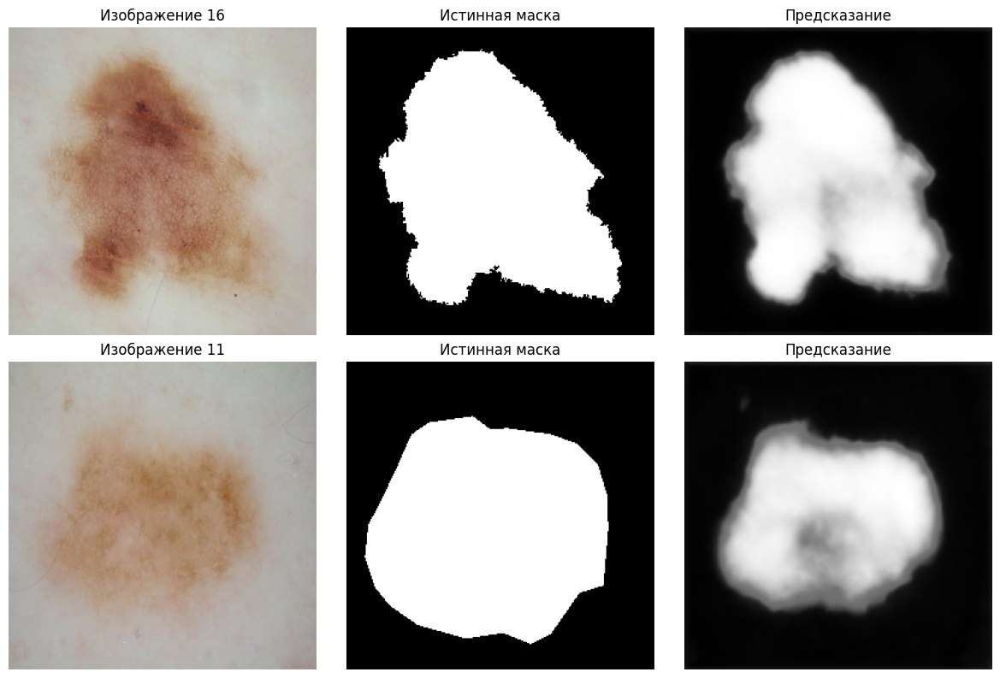

# Годовой проект 2025

## Тема

**Разработка системы сегментации и детекции кожных образований с использованием датасета ISIC.**

### Руководитель
Роман Белый @rbyelyy

### Участники
- Пономарев Максим @markterris
- Гриценко Артем @ryebroox

## Описание проекта

Учебный проект по обработке медицинских изображений для сегментации, классификации и детекции кожных заболеваний.

## Цель проекта

Изучить технологию компьютерного зрения и разработать с ее помощью сервис для автоматической обработки и анализа медицинских изображений с поражениями кожи.

## Используемые наборы данных
*   **Основной датасет:** [ISIC 2018 Task 1](https://www.kaggle.com/datasets/tschandl/isic2018-challenge-task1-data-segmentation)
*   **Описание:** Тестовый, тренировочный и валидационный датасеты с изображениями различных дефектов кожного покрова и соответствующими масками сегментации
*   **Лицензия:** [CC0: Public Domain](https://creativecommons.org/publicdomain/zero/1.0/).

## План работы

### Этап 1: Подготовка данных и окружения
- Постановка задачи. Четко сформулировать задачу на разработку и требования к результату.
- Анализ датасета. Анализ распределения классов, качества разметки и артефактов.
- Предобработка данных. Нормализация, аугментация (повороты, отражения) для увеличения разнообразия данных и борьбы с переобучением.
- Настройка инфраструктуры. Выбрать платформу для разработки, определить вычислительные ресурсы и изучить лимиты.

### Этап 2: План-минимум. Бинарная сегментация
- Архитектура. Выбор архитектуры модели и функции потерь.
- Обучение модели. Цель - получить работающий бейзлайн, который будем улучшать.
- Валидация модели. Вывести оценку бейзланового решения и поставить целевые метрики для финальной модели.
- Итеративное улучшение модели. Подбор гиперпараметров и разных функций потерь.
- Тестирование модели. Выбор лучшей модели при достижении целевой оценки качества.
- Подведение итогов. Зафиксировать результаты и оценку финальной модели, сделать выводы.

### Этап 3: План-максимум. Классификация и детекция
- **Задача классификации:** Использовать датасет [ISIC 2018 Task 2](https://www.kaggle.com/datasets/thanhngnguyn/isic-2018-task-2-lesion-attribute-detection) для автоматической детекции и классификации паттернов поражения кожи.
- **Исследовательская часть:** Использовать датасет [ISIC 2018 Task 3](https://www.kaggle.com/datasets/hitman1309/isic-2018-task-3) для автоматической диагностики заболевания на основе изображений поражения кожи.


---

## Чекпоинт 3

Предобработка данных:
- Сэмплинг для первичной тренировки
- Нормализация
- Ресайзинг
- Разбиение train/val со стратификацией
- Аугментация train выборки

Обучение:
- Простая модель по архитектуре U-Net
- BCE-loss - функция потерь, подходящая для бинарной классификации
- Метрики качества Dice Score - целевая метика точности, Intersection over Union - дополнительная метрика

### Результаты:

https://colab.research.google.com/drive/1N9fyVjRoeCRmRXZbFA4ZV07bmWZsitw5#scrollTo=n4fr07dwvMtf

base-line, обученный на семпле из 100 изображений и 10 эпохах
получена точность 0.83

Пример предсказания




## Чекпоинт 4

Вклад участников:
- Пономарев Максим:
  Разработка FastAPI сервиса, реализация endpoints (/forward, /history, /stats), настройка базы данных SQLAlchemy, логирование запросов, обработка ошибок, тестирование, документация

- Гриценко Артем:
  Подготовка модели для inference, адаптация для работы на CPU, обработка изображений для API, интеграция модели с FastAPI, конвертация результатов в base64

### Описание

FastAPI ML-сервис для сегментации поражений кожи с использованием обученной U-Net модели.
Сервис предоставляет endpoints для инференса, истории запросов и статистики.

### Требования

- Python 3.10+
- Все зависимости управляются через `uv`

### Установка зависимостей

```bash
uv sync
```

### Запуск FastAPI

```bash
uv run python main.py
```

API доступен по адресу `http://localhost:8000`

### Запуск Streamlit

```bash
uv run streamlit run src/streamlit_app.py
```

Веб-интерфейс доступен по адресу `http://localhost:8501`

### API Endpoints

#### 1. POST /forward

Выполняет сегментацию загруженного изображения.

#### 2. GET /history

Возвращает историю всех запросов.

#### 3. GET /stats

Возвращает статистику по всем обработанным запросам.

#### 4. GET /health

Проверка работоспособности сервиса.

### База данных

Используется SQLite. Файл БД хранится в: `./data/requests_history.db`

### Инференс

- **Архитектура**: U-Net
- **Вход**: RGB изображения (автоматически изменяются до 256x256)
- **Выход**: Бинарная маска сегментации (PNG в формате base64)
